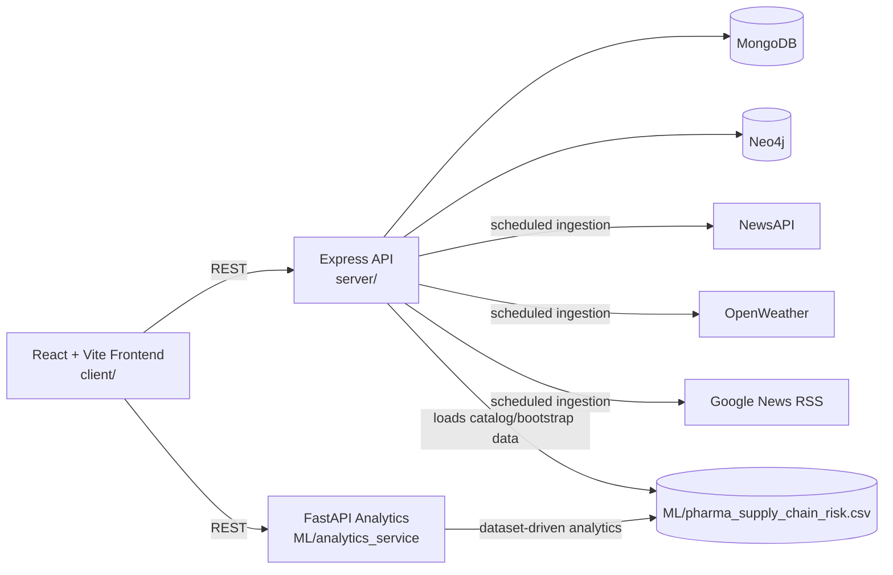

# PuranPoli Protocol

An AI-assisted pharma supply chain control tower that combines a visual graph builder, live disruption intelligence, and topology-aware risk analytics.

## Why This Project Matters

Pharma supply chains are highly interconnected and fragile. A single disrupted supplier, weather event, or port issue can cascade into stockouts and compliance risk.

This project helps teams:
- Model multi-tier supply networks visually.
- Detect and monitor real-world disruption signals.
- Compute risk scores for each node and identify vulnerabilities.
- Simulate disruption scenarios and export decision-ready reports.

## What Is Implemented

| Module | What it does |
|---|---|
| Graph Builder | Drag-and-drop supply chain graph with workspace support and demo loading |
| Risk Engine (Node/Express) | Computes node risk using internal attributes plus external disruptions |
| External Intelligence | Ingests NewsAPI, OpenWeather, and Google News RSS; scores disruption severity |
| ML Analytics (FastAPI) | Topology-aware predictions: SPOF, bottlenecks, geographic concentration, mismatch |
| Ops Views | Dashboard, Disruptions, Live Intel Feed, Reports export, Settings |

## Judge Quick Demo (5 Minutes)

1. Open the app and go to `Graph Builder`.
2. Click `Load Demo` to generate a complete sample network.
3. Click `Compute Risks`.
4. Open `Risk Analysis` to view SPOF, bottlenecks, and concentration insights.
5. Open `Disruptions` and `Live Intelligence Feed` to inspect external signals.
6. Open `Simulation` and run a scenario on a high-risk node.
7. Open `Reports` and export CSV/JSON evidence.

## Architecture



## Tech Stack

- Frontend: React 19, Vite, Tailwind CSS, React Router, React Flow (`@xyflow/react`), Recharts
- Backend: Node.js, Express, Mongoose, Neo4j driver, node-cron
- Intelligence: NewsAPI, OpenWeather, Google News RSS, sentiment + keyword scoring
- Analytics: FastAPI, pandas, numpy, scikit-learn ecosystem
- Data: MongoDB + Neo4j + pharma CSV dataset

## Repository Structure

```text
client/                  React frontend
server/                  Express API + risk engine + external intelligence
ML/                      Dataset + FastAPI analytics service
  analytics_service/     Topology-aware analytics endpoints
```

## Local Setup

### Prerequisites

- Node.js 18+
- npm 9+
- Python 3.10+
- MongoDB running locally (default `27017`)
- Neo4j running locally (default Bolt `7687`)

### 1) Install dependencies

```powershell
cd server
npm install

cd ..\client
npm install

cd ..\ML
python -m venv .venv
.\.venv\Scripts\Activate.ps1
pip install -r requirements.txt
```

### 2) Configure environment variables

Create `server/.env`:

```env
NODE_ENV=development
PORT=5000
MONGODB_URL=mongodb://127.0.0.1:27017/puranpoli_protocol

NEO4J_URI=bolt://localhost:7687
NEO4J_USERNAME=neo4j
NEO4J_PASSWORD=your_neo4j_password

NEWSAPI_KEY=your_newsapi_key
OPENWEATHER_KEY=your_openweather_key
```

Create `client/.env`:

```env
VITE_API_URL=http://localhost:5000/api/v1
VITE_ANALYTICS_API_URL=http://localhost:8001
```

Optional for analytics dataset override (PowerShell):

```powershell
$env:DATASET_PATH="C:\path\to\your\dataset.csv"
```

### 3) Start services (3 terminals)

Terminal A:

```powershell
cd server
npm run dev
```

Terminal B:

```powershell
cd ML
.\.venv\Scripts\Activate.ps1
uvicorn analytics_service.main:app --host 0.0.0.0 --port 8001 --reload
```

Terminal C:

```powershell
cd client
npm run dev
```

Open `http://localhost:5173`.

## Default Ports

- Frontend: `5173`
- Backend API: `5000`
- Analytics API: `8001`
- MongoDB: `27017`
- Neo4j Bolt: `7687`

## API Quick Reference

### Health

- `GET /api/v1/health`
- `GET /health` (analytics service)

### Graph + Workspaces

- `GET /api/v1/workspaces`
- `POST /api/v1/workspaces`
- `GET /api/v1/graph?workspace=<id>`
- `POST /api/v1/graph/demo`
- `POST /api/v1/graph/compute-risks`
- `POST /api/v1/nodes`
- `POST /api/v1/edges`

### Disruptions + Intelligence

- `GET /api/v1/disruptions`
- `GET /api/v1/disruptions/high-risk`
- `GET /api/v1/disruptions/stats`
- `POST /api/v1/disruptions/ingest` (manual trigger)
- `GET /api/v1/disruptions/live/news`
- `GET /api/v1/disruptions/live/weather`
- `GET /api/v1/disruptions/live/google-news`
- `GET /api/v1/nodes/:id/disruptions`
- `GET /api/v1/nodes/:id/intelligence`

### Catalog + Suppliers

- `GET /api/v1/catalog`
- `POST /api/v1/catalog/seed`
- `GET /api/v1/suppliers`
- `POST /api/v1/suppliers/import-csv`

### Analytics (FastAPI)

- `GET /analytics/overview`
- `GET /analytics/single-point-of-failure`
- `GET /analytics/geographic-concentration`
- `GET /analytics/supplier-reliability`
- `GET /analytics/demand-supply-mismatch`
- `POST /analytics/predict-graph`

## Risk Logic Summary

### Backend composite node risk (Express)

- Composite risk blends internal and external components.
- Internal factors include reliability gap, dependency, compliance, GMP/FDA status, and financial health.
- External factors come from disruption severity in the node country (last 48h), plus weather in node intelligence mode.
- Output includes `risk_score` (0-100), `risk_probability` (`Low`, `Moderate`, `High`, `Critical`), and `external_risk_score`.

### Topology-aware graph analytics (FastAPI)

- Detects articulation points using Tarjan's algorithm.
- Flags bottlenecks based on in-degree/out-degree structure.
- Computes per-node contextual risk and mismatch index.
- Produces vulnerability lists, reliability ranking, geographic HHI concentration, and SPOF insights.

## Scheduler Behavior

- News ingestion: every 30 minutes
- Weather ingestion: every 60 minutes
- Google News ingestion: every 45 minutes

Manual ingestion is available via `POST /api/v1/disruptions/ingest`.

## Troubleshooting

- Backend fails on startup with DB error:
  Ensure MongoDB and Neo4j are both running and credentials in `server/.env` are correct.
- Risk Analysis page shows analytics error:
  Ensure FastAPI service is running on port `8001`.
- No disruption events:
  Add valid `NEWSAPI_KEY` and `OPENWEATHER_KEY`, then trigger ingestion.
- Empty graph/dashboard:
  Use `Load Demo` in Graph Builder to seed a complete sample network.

## Current Scope and Next Steps

Current implementation focuses on end-to-end graph, risk, intelligence, and analytics workflows. Planned enhancements include:
- Role-based access control (RBAC)
- Live collaboration and multi-tenant controls
- Production deployment (Docker + CI/CD)
- Advanced what-if simulation engine backed by server-side models

## Team

`PuranPoli Protocol`
