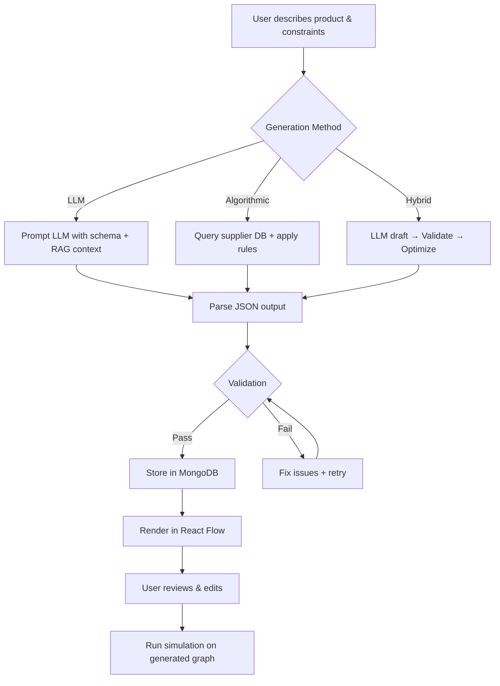

# AI-Powered Supply Chain Graph Generation — Research Guide

## The Big Picture

```
User Input (product, region, constraints)
       ↓
  AI Assistant (LLM + domain knowledge)
       ↓
  Theoretical Supply Chain (JSON structure)
       ↓
  Graph Visualization (React Flow / D3.js)
```

---

## Phase 1: Data Requirements

### What Data Does the Assistant Need?

| Data Category | Examples | Source |
|---|---|---|
| **Product Info** | Drug name, API ingredients, formulation type, cold-chain required | User input or drug databases |
| **Supplier Database** | Manufacturer names, locations, capacities, certifications (GMP/FDA) | Public registries, your MongoDB catalog |
| **Geographic Data** | Country risk scores, trade routes, port locations, regulatory zones | World Bank, WHO, trade databases |
| **Logistics Data** | Transit times, transport modes (air/sea/road), costs per route | Shipping APIs, logistics databases |
| **Regulatory Data** | Import/export rules per country, licensing requirements | Customs databases, WHO prequalification |
| **Historical Data** | Past disruptions, seasonal demand, supplier reliability | Your own platform's historical records |

### Data Formats You'd Feed the Model

```json
{
  "product": {
    "name": "Paracetamol 500mg Tablets",
    "api_ingredients": ["Paracetamol"],
    "requires_cold_chain": false,
    "annual_demand_units": 5000000,
    "target_markets": ["India", "Kenya", "Nigeria"]
  },
  "constraints": {
    "max_lead_time_days": 45,
    "budget_usd": 2000000,
    "require_gmp": true,
    "require_fda": false,
    "preferred_regions": ["Asia", "Europe"]
  }
}
```

---

## Phase 2: Generation Approaches

### Approach A — LLM-Based Generation (Recommended for your project)

Use an LLM (GPT-4 / Gemini / Claude) with structured prompting to generate the supply chain as JSON.

**How it works:**
1. User describes the product + constraints to the assistant
2. LLM generates a supply chain structure using domain knowledge
3. Output is structured JSON → fed into React Flow for visualization

**Prompt Engineering Strategy:**
```
System prompt:
"You are a pharmaceutical supply chain expert. Given a product 
description and constraints, generate a realistic supply chain 
as a JSON graph with nodes (suppliers, manufacturers, warehouses, 
distributors) and edges (transport links with lead times, costs, 
and transport modes). Include risk scores based on country stability 
and supplier reliability."

User prompt:
"Generate a supply chain for Paracetamol 500mg targeting India, 
with GMP-certified suppliers, max 45-day lead time, and budget 
of $2M. Include at least 2 alternative suppliers for redundancy."
```

**Output schema the LLM should follow:**
```json
{
  "nodes": [
    {
      "id": "sup-001",
      "type": "Tier1Supplier",
      "name": "Anqi Chemicals Ltd",
      "country": "China",
      "city": "Shanghai",
      "capacity": 50000,
      "gmp_status": true,
      "risk_score": 35,
      "cost_per_unit": 0.02
    }
  ],
  "edges": [
    {
      "source": "sup-001",
      "target": "mfg-001",
      "transport_mode": "sea",
      "lead_time_days": 21,
      "cost_per_shipment": 15000,
      "dependency_percent": 70
    }
  ]
}
```

**Pros:** Fast to implement, leverages LLM world knowledge, flexible  
**Cons:** Hallucination risk, needs validation layer, non-deterministic

---

### Approach B — Rule-Based / Algorithmic Generation

Use predefined rules and templates to construct supply chains programmatically.

**Algorithm:**
```
1. Identify required node types from product profile:
   - Raw Material → API Supplier → Manufacturer → Packager →
     Warehouse → Distributor → End Market

2. For each node type, query your supplier database:
   - Filter by: capability, certification, country, capacity
   - Rank by: cost, reliability, lead time, risk score

3. Generate edges based on:
   - Geographic proximity (haversine distance)
   - Trade route feasibility
   - Lead time constraints
   - Cost optimization

4. Apply redundancy rules:
   - Dual-source critical nodes (≥2 suppliers per tier)
   - Alternate route generation

5. Calculate aggregate metrics:
   - Total lead time (critical path)
   - Total cost
   - Overall risk score
```

**Key Algorithms:**
| Algorithm | Purpose |
|---|---|
| **Shortest Path (Dijkstra)** | Find optimal routes by cost/time |
| **Minimum Spanning Tree (Kruskal/Prim)** | Minimum cost network |
| **Critical Path Method (CPM)** | Identify bottleneck lead times |
| **K-Means Clustering** | Group suppliers by region for hub placement |
| **Multi-Criteria Decision Analysis (MCDA)** | Rank suppliers by weighted criteria |

**Pros:** Deterministic, explainable, no hallucination  
**Cons:** Requires well-populated database, rigid, lots of rules to write

---

### Approach C — Hybrid (Best of Both)

Combine LLM for initial draft + algorithmic validation/optimization.

```
User Input → LLM generates initial graph (Approach A)
                      ↓
          Validation Engine checks:
            - Do these suppliers actually exist in DB?
            - Are lead times realistic?
            - Are certifications valid?
            - Does total cost fit budget?
                      ↓
          Optimizer refines:
            - Swap hallucinated nodes with real DB entries
            - Recalculate costs and lead times
            - Add redundancy if missing
                      ↓
          Final validated supply chain → Visualization
```

> [!TIP]
> **This is the recommended approach** — LLMs are great for creative generation, but supply chain data needs to be grounded in reality.

---

## Phase 3: Models & Tech Stack

### For LLM-Based Generation

| Component | Options |
|---|---|
| **LLM** | GPT-4o, Gemini 1.5 Pro, Claude 3.5, or open-source (Llama 3, Mistral) |
| **Framework** | LangChain, LlamaIndex, or direct API calls |
| **Output Parsing** | Structured Output / JSON mode (GPT `response_format: "json_object"`) |
| **RAG (optional)** | Feed supplier database as context for grounded generation |
| **Embedding Model** | OpenAI `text-embedding-3-small` or `all-MiniLM-L6-v2` for similarity search |
| **Vector DB** | Pinecone, ChromaDB, or Weaviate (for supplier lookup via RAG) |

### For Algorithmic Components

| Component | Library |
|---|---|
| **Graph algorithms** | `networkx` (Python), `graphlib` (JS) |
| **Optimization** | `scipy.optimize`, `PuLP` (linear programming), `OR-Tools` |
| **Geospatial** | `geopy` (distance calc), `folium` (map viz) |
| **Clustering** | `scikit-learn` (K-Means for hub placement) |
| **Risk scoring** | Your existing [riskEngine.js](file:///C:/Users/DELL/OneDrive/Desktop/PuranPoli-Protocol-BlueBit-Fork/server/src/services/riskEngine.js) formulas |

### For Visualization

| Tool | Use Case |
|---|---|
| **React Flow** | Interactive graph (you already use this) |
| **D3.js** | Custom force-directed layouts |
| **Cytoscape.js** | Advanced graph analysis + visualization |
| **Mapbox / Leaflet** | Geographic supply chain map overlay |

---

## Phase 4: Generation Pipeline



---

## Phase 5: What You Specifically Need

Given your existing PuranPoli Protocol stack:

### Minimum Viable Implementation

1. **Add an LLM endpoint** in your ML service ([main.py](file:///C:/Users/DELL/OneDrive/Desktop/PuranPoli-Protocol-BlueBit-Fork/ML/analytics_service/main.py)):
   - `POST /analytics/generate-supply-chain`
   - Takes product description + constraints
   - Calls GPT-4o / Gemini API with structured prompt
   - Returns JSON graph matching your Node/Edge schema

2. **Add validation** in the same endpoint:
   - Cross-reference generated suppliers with your catalog DB
   - Validate lead times and costs against realistic ranges
   - Auto-assign risk scores using your [riskEngine.js](file:///C:/Users/DELL/OneDrive/Desktop/PuranPoli-Protocol-BlueBit-Fork/server/src/services/riskEngine.js) formulas

3. **Frontend: "AI Generate" button** in Graph Builder:
   - Opens a modal with product/constraint form
   - Calls the generation API
   - Loads the result into React Flow
   - User can then edit, save to workspace

### Data You Need to Collect/Prepare

| Priority | Data | Why |
|---|---|---|
| **P0** | Supplier catalog (name, type, location, capability, certifications) | Foundation for realistic graphs |
| **P0** | Standard lead times per route type (sea/air/road by region pair) | Realistic edge weights |
| **P1** | Historical cost data per material/transport mode | Cost estimation |
| **P1** | Country risk indices | Risk scoring |
| **P2** | Demand forecasts per market | Capacity planning |
| **P2** | Regulatory requirements per country | Compliance validation |

---

## Quick Decision Matrix

| Factor | LLM Only | Rules Only | Hybrid |
|---|---|---|---|
| **Speed to implement** | ⭐⭐⭐⭐⭐ | ⭐⭐ | ⭐⭐⭐ |
| **Accuracy** | ⭐⭐ | ⭐⭐⭐⭐ | ⭐⭐⭐⭐⭐ |
| **Flexibility** | ⭐⭐⭐⭐⭐ | ⭐⭐ | ⭐⭐⭐⭐ |
| **Needs large DB** | No | Yes | Partial |
| **Hallucination risk** | High | None | Low |
| **Cost** | LLM API costs | Free | LLM API costs |

> [!IMPORTANT]
> **Recommended path:** Start with **Approach A (LLM-only)** for a quick prototype, then evolve to **Approach C (Hybrid)** as your supplier database grows.
